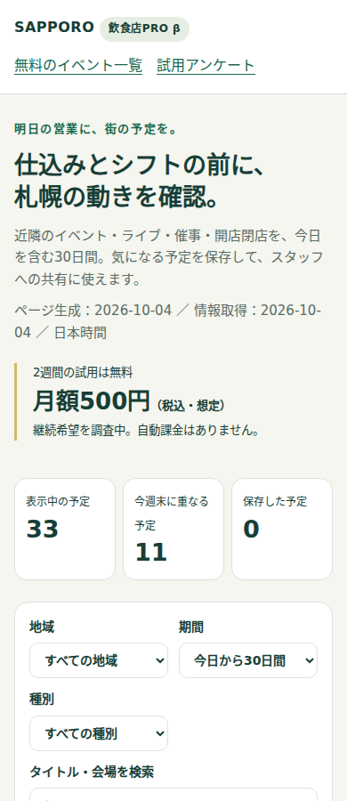
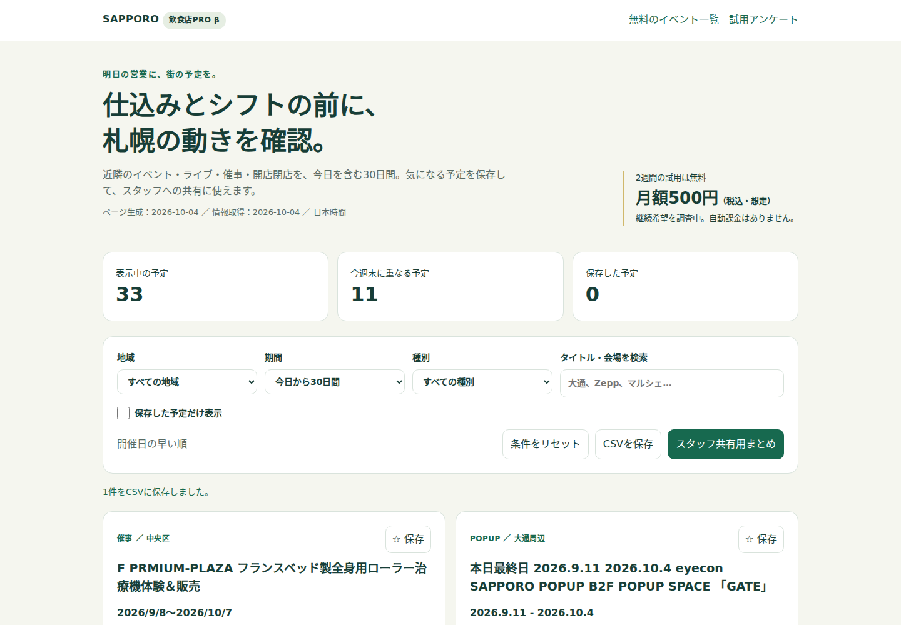

# 検証結果（2026-10-04）

## 結果

既存DB762件を読み取り専用で処理し、今日を含む30日間（10/4〜11/2）の営業参考情報33件を生成した。

| 判定 | 件数 |
| --- | ---: |
| 表示 | 33 |
| 開催日不明・不正・終了日未確定 | 15 |
| 終了済み・対象期間外 | 327 |
| 映画（PRO対象外） | 201 |
| 中止・開催延期 | 5 |
| 対象カテゴリなし | 180 |
| 統合した重複 | 1 |
| 不正URL | 0 |

表示内訳：催事8、POPUP9、イベント9、ライブ7。開店・閉店は今回の対象期間の確定日データが0件だったため、機能は実装しているが実データ掲載の有用性はまだ評価できない。所在地確認待ちは2件。情報源の網羅性や日付の正しさを保証する件数ではない。

`data/index.html`、`data/upcoming.html`、`data/events.db` は元コミットとSHA-256が一致。無料ページの既存成果物・DBを保持した。収集コード側には次回生成時に効く映画公開日判定と、別日/別会場の公演を統合しない表示修正を加えた。

## 自動テスト

`python3 -m unittest discover -s tests -v`：9テスト成功。

- 日付形式、月省略、年末年始、年なし過去日を翌年へ繰り越さないこと。
- 不正日付、日付不明、終了日がない無期限表記の除外。
- 今日、過去、30日間の最終日、期間外の境界。
- 表記正規化による統合とリンク保持、別日/別会場を別件として保持。
- DB内容を変更しないこと、安全なJSON埋め込み、不正URL除外。
- 更新でお気に入り用IDが変わらないこと。
- 無料サイトの映画分類・HTML生成から公開済み/公開当日を除外し、将来公開を残すこと。
- 無料サイトでも同名・同会場の別日公演を残すこと。

Python構文チェックと `git diff --check` も成功。CIに同じユニットテストを追加した。GitHub Actionsの実行結果はPRで別途確認する。

## ブラウザ操作・表示

Chromiumのヘッドレス実行で `tests/ui_pro_beta.cjs` 成功。検証日を日本時間2026-10-04に固定した再現テスト。

検索・地域絞り込み・リセット、保存、メモ入力と再読み込み保持、CSVダウンロード、表計算式として実行され得るメモのエスケープ、スタッフ共有ダイアログ、アンケートJSON保存、閲覧日が進んだときの終了済み除外と古いページ警告を確認した。JavaScriptエラー0。

320 / 375 / 390 / 768 / 1440px でページの横はみ出しなし。390pxと1440pxの画像を目視確認した。これはブラウザ幅の検証で、Android/iPhone実機の試験ではない。

## 未検証・次の確認

- 全収集先のオンライン巡回や営業判断に使えるかの店舗実測は未実施。今回の検証は保存済みデータと操作の確認。
- 実際の10〜20店舗の回答は未取得。有料需要を確認済みとは扱わない。
- 開店・閉店データの開催日取得率、会場表記違いによる重複、同日複数公演の識別は試用中に確認。
- 会員保護・課金・自動通知・回答送信は未実装。月額500円は想定価格。
- PRをマージしてページ公開・生成手順を確認した後に、担当者が試用案内を送る。今回送信していない。
